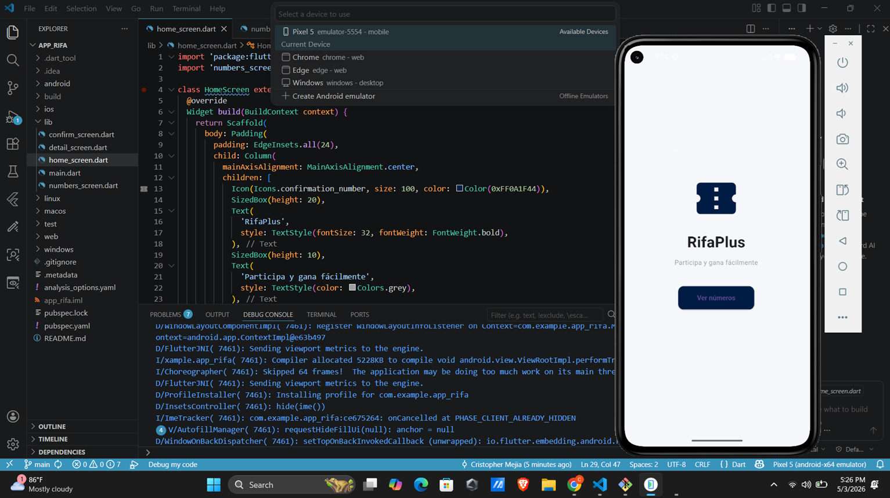

# RifaPlus - Aplicación de Rifa Digital en Flutter

## Descripción

RifaPlus es una aplicación móvil desarrollada en Flutter que permite gestionar una rifa digital de manera sencilla, moderna y visualmente atractiva. La aplicación muestra números del 01 al 20, cada uno con su estado (Disponible o Reservado), permitiendo al usuario seleccionar un número, visualizar su detalle y confirmar su reserva.

El diseño fue mejorado para ofrecer una experiencia más profesional, simulando una aplicación real con identidad visual propia, uso de colores personalizados, tarjetas modernas y navegación fluida entre pantallas.

## Objetivo

Desarrollar una aplicación funcional que integre:

* Diseño de interfaces con widgets de Flutter
* Navegación entre pantallas
* Manejo de datos estáticos en Dart
* Uso de GitHub con historial de commits

## Concepto de Diseño

La aplicación utiliza una identidad visual ficticia:

* Nombre: RifaPlus
* Estilo: moderno y minimalista
* Colores:

  * Azul oscuro como color principal
  * Fondo claro para mejorar la legibilidad
* Componentes visuales:

  * Tarjetas con bordes redondeados
  * Grid de selección de números
  * Iconografía clara y moderna

## Estructura del Proyecto

```bash
lib/
main.dart
home_screen.dart
numbers_screen.dart
detail_screen.dart
confirm_screen.dart
```

## Funcionalidades

* Visualización de 20 números (01–20)
* Estado dinámico: Disponible o Reservado
* Selección interactiva mediante interfaz gráfica
* Vista detallada del número seleccionado
* Confirmación de reserva con retroalimentación visual
* Cambio de estado tras la reserva
* Navegación completa entre pantallas

## Ejecución del Proyecto

Para ejecutar la aplicación:

```bash
flutter run
```

La aplicación se ejecuta sin errores y permite interacción completa en todas sus pantallas.

## Código Principal

### main.dart

```dart
import 'package:flutter/material.dart';
import 'home_screen.dart';

void main() {
  runApp(MyApp());
}

class MyApp extends StatelessWidget {
  @override
  Widget build(BuildContext context) {
    return MaterialApp(
      title: 'RifaPlus',
      debugShowCheckedModeBanner: false,
      theme: ThemeData(
        primaryColor: Color(0xFF0A1F44),
        scaffoldBackgroundColor: Color(0xFFF5F7FA),
        appBarTheme: AppBarTheme(
          backgroundColor: Color(0xFF0A1F44),
          elevation: 0,
        ),
      ),
      home: HomeScreen(),
    );
  }
}
```

### home_screen.dart

```dart
import 'package:flutter/material.dart';
import 'numbers_screen.dart';

class HomeScreen extends StatelessWidget {
  @override
  Widget build(BuildContext context) {
    return Scaffold(
      body: Padding(
        padding: EdgeInsets.all(24),
        child: Column(
          mainAxisAlignment: MainAxisAlignment.center,
          children: [
            Icon(Icons.confirmation_number, size: 100, color: Color(0xFF0A1F44)),
            SizedBox(height: 20),
            Text(
              'RifaPlus',
              style: TextStyle(fontSize: 32, fontWeight: FontWeight.bold),
            ),
            SizedBox(height: 10),
            Text(
              'Participa y gana fácilmente',
              style: TextStyle(color: Colors.grey),
            ),
            SizedBox(height: 40),
            ElevatedButton(
              style: ElevatedButton.styleFrom(
                padding: EdgeInsets.symmetric(horizontal: 40, vertical: 15),
                backgroundColor: Color(0xFF0A1F44),
                shape: RoundedRectangleBorder(
                  borderRadius: BorderRadius.circular(12),
                ),
              ),
              child: Text('Ver números'),
              onPressed: () {
                Navigator.push(
                  context,
                  MaterialPageRoute(builder: (_) => NumbersScreen()),
                );
              },
            ),
          ],
        ),
      ),
    );
  }
}
```

### numbers_screen.dart

```dart
import 'package:flutter/material.dart';
import 'detail_screen.dart';

class NumbersScreen extends StatefulWidget {
  @override
  _NumbersScreenState createState() => _NumbersScreenState();
}

class _NumbersScreenState extends State<NumbersScreen> {
  List<Map<String, dynamic>> numeros = List.generate(
    20,
    (index) => {
      "numero": (index + 1).toString().padLeft(2, '0'),
      "reservado": false
    },
  );

  @override
  Widget build(BuildContext context) {
    return Scaffold(
      appBar: AppBar(
        title: Text('Selecciona tu número'),
      ),
      body: Padding(
        padding: EdgeInsets.all(10),
        child: GridView.builder(
          itemCount: numeros.length,
          gridDelegate: SliverGridDelegateWithFixedCrossAxisCount(
            crossAxisCount: 3,
            childAspectRatio: 1.1,
          ),
          itemBuilder: (context, index) {
            bool reservado = numeros[index]["reservado"];

            return GestureDetector(
              onTap: () async {
                final result = await Navigator.push(
                  context,
                  MaterialPageRoute(
                    builder: (_) => DetailScreen(
                      numero: numeros[index]["numero"],
                    ),
                  ),
                );

                if (result == true) {
                  setState(() {
                    numeros[index]["reservado"] = true;
                  });
                }
              },
              child: Card(
                color: reservado ? Colors.grey : Colors.white,
                shape: RoundedRectangleBorder(
                  borderRadius: BorderRadius.circular(15),
                ),
                elevation: 4,
                child: Center(
                  child: Text(
                    numeros[index]["numero"],
                    style: TextStyle(
                      fontSize: 22,
                      fontWeight: FontWeight.bold,
                      color: reservado ? Colors.white : Color(0xFF0A1F44),
                    ),
                  ),
                ),
              ),
            );
          },
        ),
      ),
    );
  }
}
```

### detail_screen.dart

```dart
import 'package:flutter/material.dart';
import 'confirm_screen.dart';

class DetailScreen extends StatelessWidget {
  final String numero;

  DetailScreen({required this.numero});

  @override
  Widget build(BuildContext context) {
    return Scaffold(
      appBar: AppBar(
        title: Text('Detalle del número'),
      ),
      body: Center(
        child: Card(
          margin: EdgeInsets.all(20),
          shape: RoundedRectangleBorder(
            borderRadius: BorderRadius.circular(20),
          ),
          elevation: 6,
          child: Padding(
            padding: EdgeInsets.all(30),
            child: Column(
              mainAxisSize: MainAxisSize.min,
              children: [
                Text(
                  'Número seleccionado',
                  style: TextStyle(color: Colors.grey),
                ),
                SizedBox(height: 10),
                Text(
                  numero,
                  style: TextStyle(fontSize: 40, fontWeight: FontWeight.bold),
                ),
                SizedBox(height: 30),
                ElevatedButton(
                  style: ElevatedButton.styleFrom(
                    backgroundColor: Color(0xFF0A1F44),
                    padding: EdgeInsets.symmetric(horizontal: 30, vertical: 12),
                  ),
                  child: Text('Confirmar reserva'),
                  onPressed: () async {
                    final result = await Navigator.push(
                      context,
                      MaterialPageRoute(
                        builder: (_) => ConfirmScreen(),
                      ),
                    );

                    if (result == true) {
                      Navigator.pop(context, true);
                    }
                  },
                ),
              ],
            ),
          ),
        ),
      ),
    );
  }
}
```

### confirm_screen.dart

```dart
import 'package:flutter/material.dart';

class ConfirmScreen extends StatelessWidget {
  @override
  Widget build(BuildContext context) {
    return Scaffold(
      body: Center(
        child: Padding(
          padding: EdgeInsets.all(30),
          child: Column(
            mainAxisAlignment: MainAxisAlignment.center,
            children: [
              Icon(Icons.check_circle, color: Colors.green, size: 100),
              SizedBox(height: 20),
              Text(
                'Reserva exitosa',
                style: TextStyle(fontSize: 24, fontWeight: FontWeight.bold),
              ),
              SizedBox(height: 10),
              Text('Tu número ha sido reservado correctamente'),
              SizedBox(height: 30),
              ElevatedButton(
                style: ElevatedButton.styleFrom(
                  backgroundColor: Color(0xFF0A1F44),
                ),
                child: Text('Volver'),
                onPressed: () {
                  Navigator.pop(context, true);
                },
              ),
            ],
          ),
        ),
      ),
    );
  }
}
```

## Capturas de Pantalla

### Home



### Lista de Números


### Detalle del Número


### Confirmación de Reserva


### Vista adicional


## Conclusión

Se desarrolló una aplicación funcional en Flutter con una interfaz moderna y profesional. Se implementaron correctamente los conceptos de navegación, uso de widgets, manejo de datos estáticos y organización del proyecto. La aplicación cumple con todos los requisitos establecidos y presenta una experiencia visual superior.
